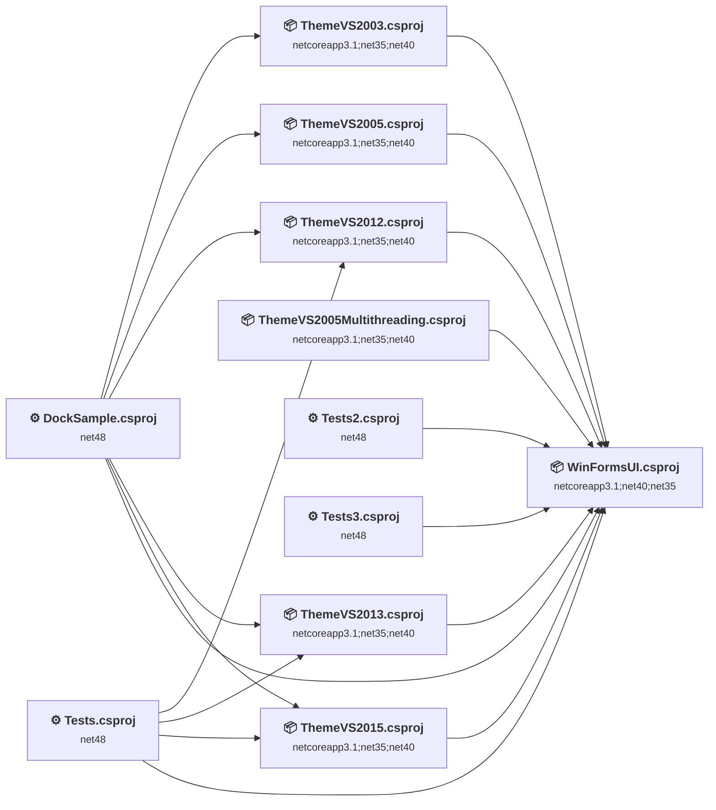
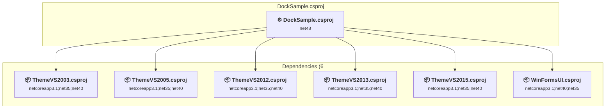
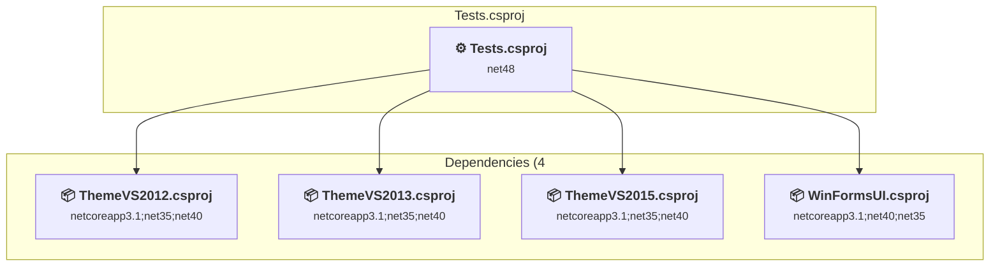
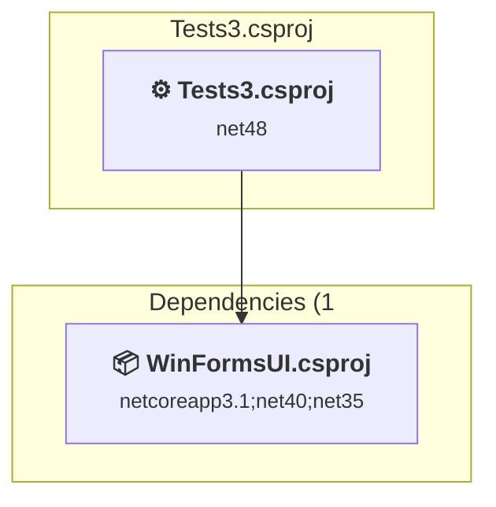
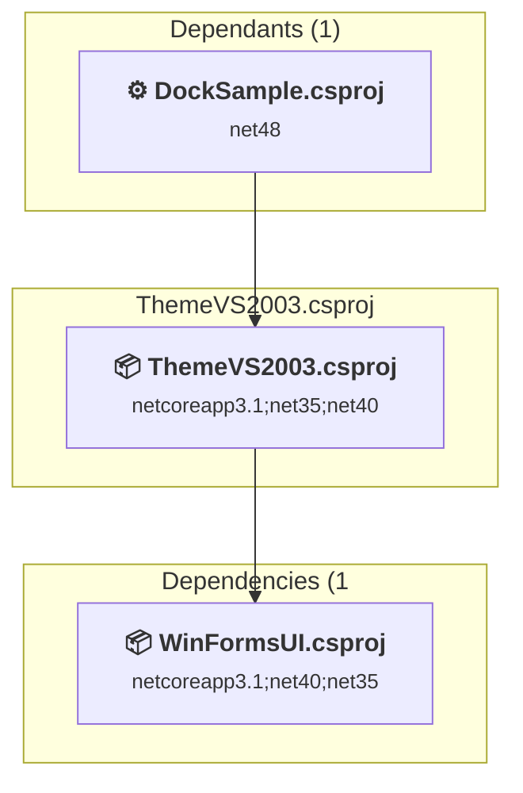
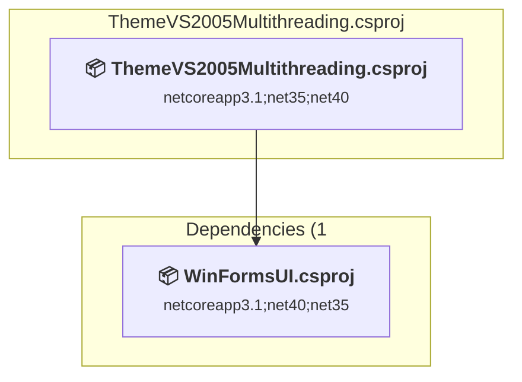
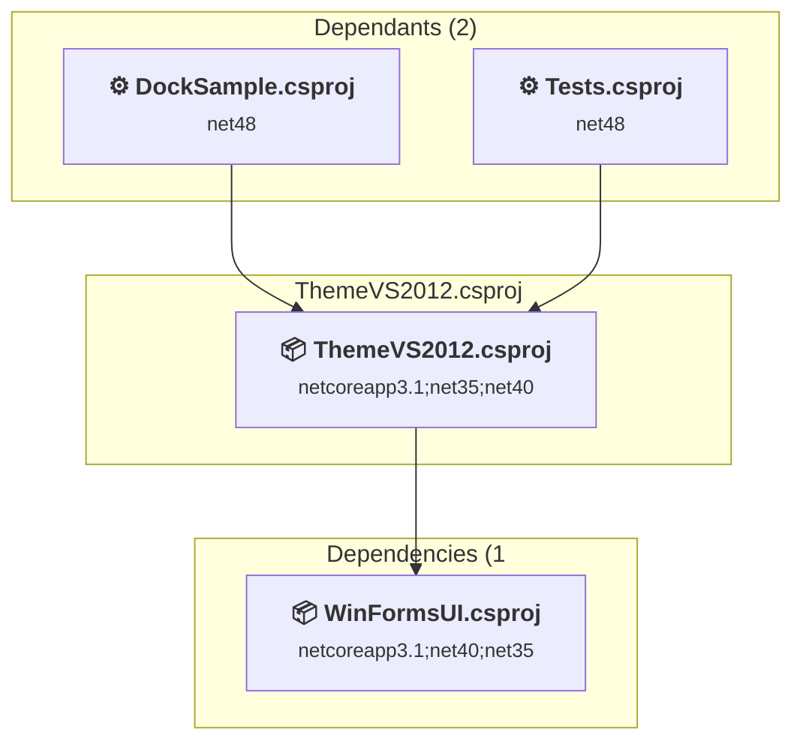

```mermaid
flowchart TB
    subgraph upstream["Dependants (10)"]
        P2["<b>⚙️&nbsp;DockSample.csproj</b><br/><small>net48</small>"]
        P3["<b>📦&nbsp;ThemeVS2013.csproj</b><br/><small>netcoreapp3.1;net35;net40</small>"]
        P4["<b>📦&nbsp;ThemeVS2012.csproj</b><br/><small>netcoreapp3.1;net35;net40</small>"]
        P5["<b>📦&nbsp;ThemeVS2003.csproj</b><br/><small>netcoreapp3.1;net35;net40</small>"]
        P6["<b>📦&nbsp;ThemeVS2005Multithreading.csproj</b><br/><small>netcoreapp3.1;net35;net40</small>"]
        P7["<b>⚙️&nbsp;Tests.csproj</b><br/><small>net48</small>"]
        P8["<b>⚙️&nbsp;Tests2.csproj</b><br/><small>net48</small>"]
        P9["<b>⚙️&nbsp;Tests3.csproj</b><br/><small>net48</small>"]
        P10["<b>📦&nbsp;ThemeVS2015.csproj</b><br/><small>netcoreapp3.1;net35;net40</small>"]
        P11["<b>📦&nbsp;ThemeVS2005.csproj</b><br/><small>netcoreapp3.1;net35;net40</small>"]
        click P2 "#docksampledocksamplecsproj"
        click P3 "#winformsuithemevs2013csproj"
        click P4 "#winformsuithemevs2012csproj"
        click P5 "#winformsuithemevs2003csproj"
        click P6 "#winformsuithemevs2005multithreadingcsproj"
        click P7 "#teststestscsproj"
        click P8 "#tests2tests2csproj"
        click P9 "#tests3tests3csproj"
        click P10 "#winformsuithemevs2015csproj"
        click P11 "#winformsuithemevs2005csproj"
    end
    subgraph current["WinFormsUI.csproj"]
        MAIN["<b>📦&nbsp;WinFormsUI.csproj</b><br/><small>netcoreapp3.1;net40;net35</small>"]
        click MAIN "#winformsuiwinformsuicsproj"
    end
    P2 --> MAIN
    P3 --> MAIN
    P4 --> MAIN
    P5 --> MAIN
    P6 --> MAIN
    P7 --> MAIN
    P8 --> MAIN
    P9 --> MAIN
    P10 --> MAIN
    P11 --> MAIN

```

# Projects and dependencies analysis

This document provides a comprehensive overview of the projects and their dependencies in the context of upgrading to .NETCoreApp,Version=v10.0.

## Table of Contents

- [Executive Summary](#executive-Summary)
  - [Highlevel Metrics](#highlevel-metrics)
  - [Projects Compatibility](#projects-compatibility)
  - [Package Compatibility](#package-compatibility)
  - [API Compatibility](#api-compatibility)
- [Aggregate NuGet packages details](#aggregate-nuget-packages-details)
- [Top API Migration Challenges](#top-api-migration-challenges)
  - [Technologies and Features](#technologies-and-features)
  - [Most Frequent API Issues](#most-frequent-api-issues)
- [Projects Relationship Graph](#projects-relationship-graph)
- [Project Details](#project-details)

  - [DockSample\DockSample.csproj](#docksampledocksamplecsproj)
  - [Tests\Tests.csproj](#teststestscsproj)
  - [Tests2\Tests2.csproj](#tests2tests2csproj)
  - [Tests3\Tests3.csproj](#tests3tests3csproj)
  - [WinFormsUI\ThemeVS2003.csproj](#winformsuithemevs2003csproj)
  - [WinFormsUI\ThemeVS2005.csproj](#winformsuithemevs2005csproj)
  - [WinFormsUI\ThemeVS2005Multithreading.csproj](#winformsuithemevs2005multithreadingcsproj)
  - [WinFormsUI\ThemeVS2012.csproj](#winformsuithemevs2012csproj)
  - [WinFormsUI\ThemeVS2013.csproj](#winformsuithemevs2013csproj)
  - [WinFormsUI\ThemeVS2015.csproj](#winformsuithemevs2015csproj)
  - [WinFormsUI\WinFormsUI.csproj](#winformsuiwinformsuicsproj)

## Executive Summary

### Highlevel Metrics

| Metric | Count | Status |
| :--- | :---: | :--- |
| Total Projects | 11 | All require upgrade |
| Total NuGet Packages | 2 | All compatible |
| Total Code Files | 238 |  |
| Total Code Files with Incidents | 136 |  |
| Total Lines of Code | 47108 |  |
| Total Number of Issues | 12664 |  |
| Estimated LOC to modify | 12649+ | at least 26.9% of codebase |

### Projects Compatibility

| Project | Target Framework | Difficulty | Package Issues | API Issues | Est. LOC Impact | Description |
| :--- | :---: | :---: | :---: | :---: | :---: | :--- |
| [DockSample\DockSample.csproj](#docksampledocksamplecsproj) | net48 | 🟡 Medium | 0 | 2614 | 2614+ | ClassicWinForms, Sdk Style = False |
| [Tests\Tests.csproj](#teststestscsproj) | net48 | 🟡 Medium | 0 | 115 | 115+ | ClassicWinForms, Sdk Style = False |
| [Tests2\Tests2.csproj](#tests2tests2csproj) | net48 | 🟢 Low | 0 | 0 |  | ClassicClassLibrary, Sdk Style = False |
| [Tests3\Tests3.csproj](#tests3tests3csproj) | net48 | 🟢 Low | 0 | 0 |  | ClassicClassLibrary, Sdk Style = False |
| [WinFormsUI\ThemeVS2003.csproj](#winformsuithemevs2003csproj) | netcoreapp3.1;net35;net40 | 🟡 Medium | 0 | 1146 | 1146+ | ClassLibrary, Sdk Style = True |
| [WinFormsUI\ThemeVS2005.csproj](#winformsuithemevs2005csproj) | netcoreapp3.1;net35;net40 | 🟡 Medium | 0 | 922 | 922+ | ClassLibrary, Sdk Style = True |
| [WinFormsUI\ThemeVS2005Multithreading.csproj](#winformsuithemevs2005multithreadingcsproj) | netcoreapp3.1;net35;net40 | 🟡 Medium | 0 | 1283 | 1283+ | ClassLibrary, Sdk Style = True |
| [WinFormsUI\ThemeVS2012.csproj](#winformsuithemevs2012csproj) | netcoreapp3.1;net35;net40 | 🟡 Medium | 0 | 1444 | 1444+ | ClassLibrary, Sdk Style = True |
| [WinFormsUI\ThemeVS2013.csproj](#winformsuithemevs2013csproj) | netcoreapp3.1;net35;net40 | 🟡 Medium | 0 | 1418 | 1418+ | ClassLibrary, Sdk Style = True |
| [WinFormsUI\ThemeVS2015.csproj](#winformsuithemevs2015csproj) | netcoreapp3.1;net35;net40 | 🟡 Medium | 0 | 1418 | 1418+ | ClassLibrary, Sdk Style = True |
| [WinFormsUI\WinFormsUI.csproj](#winformsuiwinformsuicsproj) | netcoreapp3.1;net40;net35 | 🟡 Medium | 0 | 2289 | 2289+ | ClassLibrary, Sdk Style = True |

### Package Compatibility

| Status | Count | Percentage |
| :--- | :---: | :---: |
| ✅ Compatible | 2 | 100.0% |
| ⚠️ Incompatible | 0 | 0.0% |
| 🔄 Upgrade Recommended | 0 | 0.0% |
| ***Total NuGet Packages*** | ***2*** | ***100%*** |

### API Compatibility

| Category | Count | Impact |
| :--- | :---: | :--- |
| 🔴 Binary Incompatible | 7121 | High - Require code changes |
| 🟡 Source Incompatible | 5502 | Medium - Needs re-compilation and potential conflicting API error fixing |
| 🔵 Behavioral change | 26 | Low - Behavioral changes that may require testing at runtime |
| ✅ Compatible | 69672 |  |
| ***Total APIs Analyzed*** | ***82321*** |  |

## Aggregate NuGet packages details

| Package | Current Version | Suggested Version | Projects | Description |
| :--- | :---: | :---: | :--- | :--- |
| NUnit | 3.9.0 |  | [Tests.csproj](#teststestscsproj) [Tests2.csproj](#tests2tests2csproj) [Tests3.csproj](#tests3tests3csproj) | ✅Compatible |
| NUnit3TestAdapter | 3.9.0 |  | [Tests.csproj](#teststestscsproj) [Tests2.csproj](#tests2tests2csproj) [Tests3.csproj](#tests3tests3csproj) | ✅Compatible |

## Top API Migration Challenges

### Technologies and Features

| Technology | Issues | Percentage | Migration Path |
| :--- | :---: | :---: | :--- |
| Windows Forms | 7108 | 56.2% | Windows Forms APIs for building Windows desktop applications with traditional Forms-based UI that are available in .NET on Windows. Enable Windows Desktop support: Option 1 (Recommended): Target net9.0-windows; Option 2: Add <UseWindowsDesktop>true</UseWindowsDesktop>; Option 3 (Legacy): Use Microsoft.NET.Sdk.WindowsDesktop SDK. |
| GDI+ / System.Drawing | 5502 | 43.5% | System.Drawing APIs for 2D graphics, imaging, and printing that are available via NuGet package System.Drawing.Common. Note: Not recommended for server scenarios due to Windows dependencies; consider cross-platform alternatives like SkiaSharp or ImageSharp for new code. |
| Code Access Security (CAS) | 4 | 0.0% | Code Access Security (CAS) APIs that were removed in .NET Core/.NET for security and performance reasons. CAS provided fine-grained security policies but proved complex and ineffective. Remove CAS usage; not supported in modern .NET. |
| Legacy Configuration System | 2 | 0.0% | Legacy XML-based configuration system (app.config/web.config) that has been replaced by a more flexible configuration model in .NET Core. The old system was rigid and XML-based. Migrate to Microsoft.Extensions.Configuration with JSON/environment variables; use System.Configuration.ConfigurationManager NuGet package as interim bridge if needed. |
| Windows Forms Legacy Controls | 2 | 0.0% | Legacy Windows Forms controls that have been removed from .NET Core/5+ including StatusBar, DataGrid, ContextMenu, MainMenu, MenuItem, and ToolBar. These controls were replaced by more modern alternatives. Use ToolStrip, MenuStrip, ContextMenuStrip, and DataGridView instead. |

### Most Frequent API Issues

| API | Count | Percentage | Category |
| :--- | :---: | :---: | :--- |
| T:System.Drawing.Bitmap | 1934 | 15.3% | Source Incompatible |
| T:System.Windows.Forms.ToolStripMenuItem | 513 | 4.1% | Binary Incompatible |
| T:System.Drawing.Image | 439 | 3.5% | Source Incompatible |
| T:System.Windows.Forms.DockStyle | 421 | 3.3% | Binary Incompatible |
| T:System.Drawing.Drawing2D.GraphicsPath | 316 | 2.5% | Source Incompatible |
| T:System.Drawing.Font | 297 | 2.3% | Source Incompatible |
| T:System.Windows.Forms.ControlStyles | 246 | 1.9% | Binary Incompatible |
| T:System.Windows.Forms.TextFormatFlags | 225 | 1.8% | Binary Incompatible |
| T:System.Drawing.SolidBrush | 189 | 1.5% | Source Incompatible |
| T:System.Drawing.Graphics | 181 | 1.4% | Source Incompatible |
| T:System.Drawing.StringFormat | 163 | 1.3% | Source Incompatible |
| M:System.Drawing.Drawing2D.GraphicsPath.AddLine(System.Int32,System.Int32,System.Int32,System.Int32) | 141 | 1.1% | Source Incompatible |
| T:System.Windows.Forms.RightToLeft | 138 | 1.1% | Binary Incompatible |
| T:System.Windows.Forms.ContextMenuStrip | 132 | 1.0% | Binary Incompatible |
| T:System.Windows.Forms.Control | 130 | 1.0% | Binary Incompatible |
| T:System.Drawing.StringAlignment | 126 | 1.0% | Source Incompatible |
| T:System.Drawing.Pen | 119 | 0.9% | Source Incompatible |
| P:System.Windows.Forms.Control.ClientRectangle | 110 | 0.9% | Binary Incompatible |
| T:System.Drawing.StringFormatFlags | 108 | 0.9% | Source Incompatible |
| T:System.Windows.Forms.ToolTip | 106 | 0.8% | Binary Incompatible |
| T:System.Windows.Forms.Form | 91 | 0.7% | Binary Incompatible |
| P:System.Windows.Forms.Control.Width | 89 | 0.7% | Binary Incompatible |
| T:System.Windows.Forms.ToolStripButton | 83 | 0.7% | Binary Incompatible |
| T:System.Drawing.Drawing2D.Matrix | 79 | 0.6% | Source Incompatible |
| T:System.Windows.Forms.Label | 74 | 0.6% | Binary Incompatible |
| P:System.Windows.Forms.ToolStripItem.Size | 72 | 0.6% | Binary Incompatible |
| P:System.Windows.Forms.ToolStripItem.Name | 72 | 0.6% | Binary Incompatible |
| P:System.Windows.Forms.PaintEventArgs.Graphics | 68 | 0.5% | Binary Incompatible |
| M:System.Drawing.Graphics.FillRectangle(System.Drawing.Brush,System.Drawing.Rectangle) | 66 | 0.5% | Source Incompatible |
| M:System.Windows.Forms.Control.Invalidate | 65 | 0.5% | Binary Incompatible |
| T:System.Windows.Forms.AnchorStyles | 64 | 0.5% | Binary Incompatible |
| P:System.Windows.Forms.TreeNode.Text | 63 | 0.5% | Binary Incompatible |
| P:System.Windows.Forms.TreeNode.Name | 63 | 0.5% | Binary Incompatible |
| T:System.Windows.Forms.TreeNode | 63 | 0.5% | Binary Incompatible |
| T:System.Windows.Forms.Control.ControlCollection | 62 | 0.5% | Binary Incompatible |
| P:System.Windows.Forms.Control.Controls | 62 | 0.5% | Binary Incompatible |
| P:System.Windows.Forms.Control.Visible | 62 | 0.5% | Binary Incompatible |
| P:System.Windows.Forms.TreeNode.SelectedImageIndex | 62 | 0.5% | Binary Incompatible |
| P:System.Windows.Forms.TreeNode.ImageIndex | 62 | 0.5% | Binary Incompatible |
| M:System.Drawing.Graphics.DrawLine(System.Drawing.Pen,System.Int32,System.Int32,System.Int32,System.Int32) | 58 | 0.5% | Source Incompatible |
| M:System.Windows.Forms.Control.SetStyle(System.Windows.Forms.ControlStyles,System.Boolean) | 57 | 0.5% | Binary Incompatible |
| P:System.Windows.Forms.Control.Bounds | 56 | 0.4% | Binary Incompatible |
| P:System.Windows.Forms.ToolStripItem.Text | 55 | 0.4% | Binary Incompatible |
| M:System.Windows.Forms.ToolStripMenuItem.#ctor | 55 | 0.4% | Binary Incompatible |
| M:System.Windows.Forms.TreeNode.#ctor(System.String,System.Int32,System.Int32) | 55 | 0.4% | Binary Incompatible |
| T:System.Windows.Forms.ToolStripSeparator | 54 | 0.4% | Binary Incompatible |
| T:System.Windows.Forms.TextRenderer | 52 | 0.4% | Binary Incompatible |
| M:System.Windows.Forms.Control.ControlCollection.Add(System.Windows.Forms.Control) | 51 | 0.4% | Binary Incompatible |
| P:System.Windows.Forms.Control.Height | 51 | 0.4% | Binary Incompatible |
| T:System.Windows.Forms.ToolStripRenderMode | 51 | 0.4% | Binary Incompatible |

## Projects Relationship Graph

Legend:
📦 SDK-style project
⚙️ Classic project

## Project Details

### DockSample\DockSample.csproj

#### Project Info

- **Current Target Framework:** net48
- **Proposed Target Framework:** net10.0-windows
- **SDK-style**: False
- **Project Kind:** ClassicWinForms
- **Dependencies**: 6
- **Dependants**: 0
- **Number of Files**: 40
- **Number of Files with Incidents**: 21
- **Lines of Code**: 3111
- **Estimated LOC to modify**: 2614+ (at least 84.0% of the project)

#### Dependency Graph

Legend:
📦 SDK-style project
⚙️ Classic project

### API Compatibility

| Category | Count | Impact |
| :--- | :---: | :--- |
| 🔴 Binary Incompatible | 2580 | High - Require code changes |
| 🟡 Source Incompatible | 34 | Medium - Needs re-compilation and potential conflicting API error fixing |
| 🔵 Behavioral change | 0 | Low - Behavioral changes that may require testing at runtime |
| ✅ Compatible | 2602 |  |
| ***Total APIs Analyzed*** | ***5216*** |  |

#### Project Technologies and Features

| Technology | Issues | Percentage | Migration Path |
| :--- | :---: | :---: | :--- |
| Legacy Configuration System | 2 | 0.1% | Legacy XML-based configuration system (app.config/web.config) that has been replaced by a more flexible configuration model in .NET Core. The old system was rigid and XML-based. Migrate to Microsoft.Extensions.Configuration with JSON/environment variables; use System.Configuration.ConfigurationManager NuGet package as interim bridge if needed. |
| GDI+ / System.Drawing | 32 | 1.2% | System.Drawing APIs for 2D graphics, imaging, and printing that are available via NuGet package System.Drawing.Common. Note: Not recommended for server scenarios due to Windows dependencies; consider cross-platform alternatives like SkiaSharp or ImageSharp for new code. |
| Windows Forms | 2580 | 98.7% | Windows Forms APIs for building Windows desktop applications with traditional Forms-based UI that are available in .NET on Windows. Enable Windows Desktop support: Option 1 (Recommended): Target net9.0-windows; Option 2: Add <UseWindowsDesktop>true</UseWindowsDesktop>; Option 3 (Legacy): Use Microsoft.NET.Sdk.WindowsDesktop SDK. |

### Tests\Tests.csproj

#### Project Info

- **Current Target Framework:** net48
- **Proposed Target Framework:** net10.0-windows
- **SDK-style**: False
- **Project Kind:** ClassicWinForms
- **Dependencies**: 4
- **Dependants**: 0
- **Number of Files**: 3
- **Number of Files with Incidents**: 3
- **Lines of Code**: 941
- **Estimated LOC to modify**: 115+ (at least 12.2% of the project)

#### Dependency Graph

Legend:
📦 SDK-style project
⚙️ Classic project

### API Compatibility

| Category | Count | Impact |
| :--- | :---: | :--- |
| 🔴 Binary Incompatible | 89 | High - Require code changes |
| 🟡 Source Incompatible | 0 | Medium - Needs re-compilation and potential conflicting API error fixing |
| 🔵 Behavioral change | 26 | Low - Behavioral changes that may require testing at runtime |
| ✅ Compatible | 4309 |  |
| ***Total APIs Analyzed*** | ***4424*** |  |

#### Project Technologies and Features

| Technology | Issues | Percentage | Migration Path |
| :--- | :---: | :---: | :--- |
| Windows Forms | 89 | 77.4% | Windows Forms APIs for building Windows desktop applications with traditional Forms-based UI that are available in .NET on Windows. Enable Windows Desktop support: Option 1 (Recommended): Target net9.0-windows; Option 2: Add <UseWindowsDesktop>true</UseWindowsDesktop>; Option 3 (Legacy): Use Microsoft.NET.Sdk.WindowsDesktop SDK. |

### Tests2\Tests2.csproj

#### Project Info

- **Current Target Framework:** net48
- **Proposed Target Framework:** net10.0
- **SDK-style**: False
- **Project Kind:** ClassicClassLibrary
- **Dependencies**: 1
- **Dependants**: 0
- **Number of Files**: 2
- **Number of Files with Incidents**: 1
- **Lines of Code**: 67
- **Estimated LOC to modify**: 0+ (at least 0.0% of the project)

#### Dependency Graph

Legend:
📦 SDK-style project
⚙️ Classic project

### API Compatibility

| Category | Count | Impact |
| :--- | :---: | :--- |
| 🔴 Binary Incompatible | 0 | High - Require code changes |
| 🟡 Source Incompatible | 0 | Medium - Needs re-compilation and potential conflicting API error fixing |
| 🔵 Behavioral change | 0 | Low - Behavioral changes that may require testing at runtime |
| ✅ Compatible | 43 |  |
| ***Total APIs Analyzed*** | ***43*** |  |

### Tests3\Tests3.csproj

#### Project Info

- **Current Target Framework:** net48
- **Proposed Target Framework:** net10.0
- **SDK-style**: False
- **Project Kind:** ClassicClassLibrary
- **Dependencies**: 1
- **Dependants**: 0
- **Number of Files**: 2
- **Number of Files with Incidents**: 1
- **Lines of Code**: 67
- **Estimated LOC to modify**: 0+ (at least 0.0% of the project)

#### Dependency Graph

Legend:
📦 SDK-style project
⚙️ Classic project

### API Compatibility

| Category | Count | Impact |
| :--- | :---: | :--- |
| 🔴 Binary Incompatible | 0 | High - Require code changes |
| 🟡 Source Incompatible | 0 | Medium - Needs re-compilation and potential conflicting API error fixing |
| 🔵 Behavioral change | 0 | Low - Behavioral changes that may require testing at runtime |
| ✅ Compatible | 43 |  |
| ***Total APIs Analyzed*** | ***43*** |  |

### WinFormsUI\ThemeVS2003.csproj

#### Project Info

- **Current Target Framework:** netcoreapp3.1;net35;net40
- **Proposed Target Framework:** netcoreapp3.1;net35;net40;net10.0
- **SDK-style**: True
- **Project Kind:** ClassLibrary
- **Dependencies**: 1
- **Dependants**: 1
- **Number of Files**: 45
- **Number of Files with Incidents**: 9
- **Lines of Code**: 3890
- **Estimated LOC to modify**: 1146+ (at least 29.5% of the project)

#### Dependency Graph

Legend:
📦 SDK-style project
⚙️ Classic project

### API Compatibility

| Category | Count | Impact |
| :--- | :---: | :--- |
| 🔴 Binary Incompatible | 526 | High - Require code changes |
| 🟡 Source Incompatible | 620 | Medium - Needs re-compilation and potential conflicting API error fixing |
| 🔵 Behavioral change | 0 | Low - Behavioral changes that may require testing at runtime |
| ✅ Compatible | 4786 |  |
| ***Total APIs Analyzed*** | ***5932*** |  |

#### Project Technologies and Features

| Technology | Issues | Percentage | Migration Path |
| :--- | :---: | :---: | :--- |
| Windows Forms | 526 | 45.9% | Windows Forms APIs for building Windows desktop applications with traditional Forms-based UI that are available in .NET on Windows. Enable Windows Desktop support: Option 1 (Recommended): Target net9.0-windows; Option 2: Add <UseWindowsDesktop>true</UseWindowsDesktop>; Option 3 (Legacy): Use Microsoft.NET.Sdk.WindowsDesktop SDK. |
| GDI+ / System.Drawing | 620 | 54.1% | System.Drawing APIs for 2D graphics, imaging, and printing that are available via NuGet package System.Drawing.Common. Note: Not recommended for server scenarios due to Windows dependencies; consider cross-platform alternatives like SkiaSharp or ImageSharp for new code. |

### WinFormsUI\ThemeVS2005.csproj

#### Project Info

- **Current Target Framework:** netcoreapp3.1;net35;net40
- **Proposed Target Framework:** netcoreapp3.1;net35;net40;net10.0
- **SDK-style**: True
- **Project Kind:** ClassLibrary
- **Dependencies**: 1
- **Dependants**: 1
- **Number of Files**: 17
- **Number of Files with Incidents**: 7
- **Lines of Code**: 3878
- **Estimated LOC to modify**: 922+ (at least 23.8% of the project)

#### Dependency Graph

Legend:
📦 SDK-style project
⚙️ Classic project

### API Compatibility

| Category | Count | Impact |
| :--- | :---: | :--- |
| 🔴 Binary Incompatible | 372 | High - Require code changes |
| 🟡 Source Incompatible | 550 | Medium - Needs re-compilation and potential conflicting API error fixing |
| 🔵 Behavioral change | 0 | Low - Behavioral changes that may require testing at runtime |
| ✅ Compatible | 5778 |  |
| ***Total APIs Analyzed*** | ***6700*** |  |

#### Project Technologies and Features

| Technology | Issues | Percentage | Migration Path |
| :--- | :---: | :---: | :--- |
| GDI+ / System.Drawing | 550 | 59.7% | System.Drawing APIs for 2D graphics, imaging, and printing that are available via NuGet package System.Drawing.Common. Note: Not recommended for server scenarios due to Windows dependencies; consider cross-platform alternatives like SkiaSharp or ImageSharp for new code. |
| Windows Forms | 372 | 40.3% | Windows Forms APIs for building Windows desktop applications with traditional Forms-based UI that are available in .NET on Windows. Enable Windows Desktop support: Option 1 (Recommended): Target net9.0-windows; Option 2: Add <UseWindowsDesktop>true</UseWindowsDesktop>; Option 3 (Legacy): Use Microsoft.NET.Sdk.WindowsDesktop SDK. |

### WinFormsUI\ThemeVS2005Multithreading.csproj

#### Project Info

- **Current Target Framework:** netcoreapp3.1;net35;net40
- **Proposed Target Framework:** netcoreapp3.1;net35;net40;net10.0
- **SDK-style**: True
- **Project Kind:** ClassLibrary
- **Dependencies**: 1
- **Dependants**: 0
- **Number of Files**: 41
- **Number of Files with Incidents**: 8
- **Lines of Code**: 3824
- **Estimated LOC to modify**: 1283+ (at least 33.6% of the project)

#### Dependency Graph

Legend:
📦 SDK-style project
⚙️ Classic project

### API Compatibility

| Category | Count | Impact |
| :--- | :---: | :--- |
| 🔴 Binary Incompatible | 524 | High - Require code changes |
| 🟡 Source Incompatible | 759 | Medium - Needs re-compilation and potential conflicting API error fixing |
| 🔵 Behavioral change | 0 | Low - Behavioral changes that may require testing at runtime |
| ✅ Compatible | 5987 |  |
| ***Total APIs Analyzed*** | ***7270*** |  |

#### Project Technologies and Features

| Technology | Issues | Percentage | Migration Path |
| :--- | :---: | :---: | :--- |
| GDI+ / System.Drawing | 759 | 59.2% | System.Drawing APIs for 2D graphics, imaging, and printing that are available via NuGet package System.Drawing.Common. Note: Not recommended for server scenarios due to Windows dependencies; consider cross-platform alternatives like SkiaSharp or ImageSharp for new code. |
| Windows Forms | 524 | 40.8% | Windows Forms APIs for building Windows desktop applications with traditional Forms-based UI that are available in .NET on Windows. Enable Windows Desktop support: Option 1 (Recommended): Target net9.0-windows; Option 2: Add <UseWindowsDesktop>true</UseWindowsDesktop>; Option 3 (Legacy): Use Microsoft.NET.Sdk.WindowsDesktop SDK. |

### WinFormsUI\ThemeVS2012.csproj

#### Project Info

- **Current Target Framework:** netcoreapp3.1;net35;net40
- **Proposed Target Framework:** netcoreapp3.1;net35;net40;net10.0
- **SDK-style**: True
- **Project Kind:** ClassLibrary
- **Dependencies**: 1
- **Dependants**: 2
- **Number of Files**: 60
- **Number of Files with Incidents**: 17
- **Lines of Code**: 4799
- **Estimated LOC to modify**: 1444+ (at least 30.1% of the project)

#### Dependency Graph

Legend:
📦 SDK-style project
⚙️ Classic project

### API Compatibility

| Category | Count | Impact |
| :--- | :---: | :--- |
| 🔴 Binary Incompatible | 465 | High - Require code changes |
| 🟡 Source Incompatible | 979 | Medium - Needs re-compilation and potential conflicting API error fixing |
| 🔵 Behavioral change | 0 | Low - Behavioral changes that may require testing at runtime |
| ✅ Compatible | 9406 |  |
| ***Total APIs Analyzed*** | ***10850*** |  |

#### Project Technologies and Features

| Technology | Issues | Percentage | Migration Path |
| :--- | :---: | :---: | :--- |
| Windows Forms | 465 | 32.2% | Windows Forms APIs for building Windows desktop applications with traditional Forms-based UI that are available in .NET on Windows. Enable Windows Desktop support: Option 1 (Recommended): Target net9.0-windows; Option 2: Add <UseWindowsDesktop>true</UseWindowsDesktop>; Option 3 (Legacy): Use Microsoft.NET.Sdk.WindowsDesktop SDK. |
| GDI+ / System.Drawing | 979 | 67.8% | System.Drawing APIs for 2D graphics, imaging, and printing that are available via NuGet package System.Drawing.Common. Note: Not recommended for server scenarios due to Windows dependencies; consider cross-platform alternatives like SkiaSharp or ImageSharp for new code. |

### WinFormsUI\ThemeVS2013.csproj

#### Project Info

- **Current Target Framework:** netcoreapp3.1;net35;net40
- **Proposed Target Framework:** netcoreapp3.1;net35;net40;net10.0
- **SDK-style**: True
- **Project Kind:** ClassLibrary
- **Dependencies**: 1
- **Dependants**: 2
- **Number of Files**: 36
- **Number of Files with Incidents**: 17
- **Lines of Code**: 4860
- **Estimated LOC to modify**: 1418+ (at least 29.2% of the project)

#### Dependency Graph

Legend:
📦 SDK-style project
⚙️ Classic project

### API Compatibility

| Category | Count | Impact |
| :--- | :---: | :--- |
| 🔴 Binary Incompatible | 459 | High - Require code changes |
| 🟡 Source Incompatible | 959 | Medium - Needs re-compilation and potential conflicting API error fixing |
| 🔵 Behavioral change | 0 | Low - Behavioral changes that may require testing at runtime |
| ✅ Compatible | 9436 |  |
| ***Total APIs Analyzed*** | ***10854*** |  |

#### Project Technologies and Features

| Technology | Issues | Percentage | Migration Path |
| :--- | :---: | :---: | :--- |
| GDI+ / System.Drawing | 959 | 67.6% | System.Drawing APIs for 2D graphics, imaging, and printing that are available via NuGet package System.Drawing.Common. Note: Not recommended for server scenarios due to Windows dependencies; consider cross-platform alternatives like SkiaSharp or ImageSharp for new code. |
| Windows Forms | 459 | 32.4% | Windows Forms APIs for building Windows desktop applications with traditional Forms-based UI that are available in .NET on Windows. Enable Windows Desktop support: Option 1 (Recommended): Target net9.0-windows; Option 2: Add <UseWindowsDesktop>true</UseWindowsDesktop>; Option 3 (Legacy): Use Microsoft.NET.Sdk.WindowsDesktop SDK. |

### WinFormsUI\ThemeVS2015.csproj

#### Project Info

- **Current Target Framework:** netcoreapp3.1;net35;net40
- **Proposed Target Framework:** netcoreapp3.1;net35;net40;net10.0
- **SDK-style**: True
- **Project Kind:** ClassLibrary
- **Dependencies**: 1
- **Dependants**: 2
- **Number of Files**: 36
- **Number of Files with Incidents**: 17
- **Lines of Code**: 4864
- **Estimated LOC to modify**: 1418+ (at least 29.2% of the project)

#### Dependency Graph

Legend:
📦 SDK-style project
⚙️ Classic project

### API Compatibility

| Category | Count | Impact |
| :--- | :---: | :--- |
| 🔴 Binary Incompatible | 459 | High - Require code changes |
| 🟡 Source Incompatible | 959 | Medium - Needs re-compilation and potential conflicting API error fixing |
| 🔵 Behavioral change | 0 | Low - Behavioral changes that may require testing at runtime |
| ✅ Compatible | 9440 |  |
| ***Total APIs Analyzed*** | ***10858*** |  |

#### Project Technologies and Features

| Technology | Issues | Percentage | Migration Path |
| :--- | :---: | :---: | :--- |
| GDI+ / System.Drawing | 959 | 67.6% | System.Drawing APIs for 2D graphics, imaging, and printing that are available via NuGet package System.Drawing.Common. Note: Not recommended for server scenarios due to Windows dependencies; consider cross-platform alternatives like SkiaSharp or ImageSharp for new code. |
| Windows Forms | 459 | 32.4% | Windows Forms APIs for building Windows desktop applications with traditional Forms-based UI that are available in .NET on Windows. Enable Windows Desktop support: Option 1 (Recommended): Target net9.0-windows; Option 2: Add <UseWindowsDesktop>true</UseWindowsDesktop>; Option 3 (Legacy): Use Microsoft.NET.Sdk.WindowsDesktop SDK. |

### WinFormsUI\WinFormsUI.csproj

#### Project Info

- **Current Target Framework:** netcoreapp3.1;net40;net35
- **Proposed Target Framework:** netcoreapp3.1;net40;net35;net10.0
- **SDK-style**: True
- **Project Kind:** ClassLibrary
- **Dependencies**: 0
- **Dependants**: 10
- **Number of Files**: 61
- **Number of Files with Incidents**: 35
- **Lines of Code**: 16807
- **Estimated LOC to modify**: 2289+ (at least 13.6% of the project)

#### Dependency Graph

Legend:
📦 SDK-style project
⚙️ Classic project

### API Compatibility

| Category | Count | Impact |
| :--- | :---: | :--- |
| 🔴 Binary Incompatible | 1647 | High - Require code changes |
| 🟡 Source Incompatible | 642 | Medium - Needs re-compilation and potential conflicting API error fixing |
| 🔵 Behavioral change | 0 | Low - Behavioral changes that may require testing at runtime |
| ✅ Compatible | 17842 |  |
| ***Total APIs Analyzed*** | ***20131*** |  |

#### Project Technologies and Features

| Technology | Issues | Percentage | Migration Path |
| :--- | :---: | :---: | :--- |
| Code Access Security (CAS) | 4 | 0.2% | Code Access Security (CAS) APIs that were removed in .NET Core/.NET for security and performance reasons. CAS provided fine-grained security policies but proved complex and ineffective. Remove CAS usage; not supported in modern .NET. |
| Windows Forms Legacy Controls | 2 | 0.1% | Legacy Windows Forms controls that have been removed from .NET Core/5+ including StatusBar, DataGrid, ContextMenu, MainMenu, MenuItem, and ToolBar. These controls were replaced by more modern alternatives. Use ToolStrip, MenuStrip, ContextMenuStrip, and DataGridView instead. |
| GDI+ / System.Drawing | 644 | 28.1% | System.Drawing APIs for 2D graphics, imaging, and printing that are available via NuGet package System.Drawing.Common. Note: Not recommended for server scenarios due to Windows dependencies; consider cross-platform alternatives like SkiaSharp or ImageSharp for new code. |
| Windows Forms | 1634 | 71.4% | Windows Forms APIs for building Windows desktop applications with traditional Forms-based UI that are available in .NET on Windows. Enable Windows Desktop support: Option 1 (Recommended): Target net9.0-windows; Option 2: Add <UseWindowsDesktop>true</UseWindowsDesktop>; Option 3 (Legacy): Use Microsoft.NET.Sdk.WindowsDesktop SDK. |

